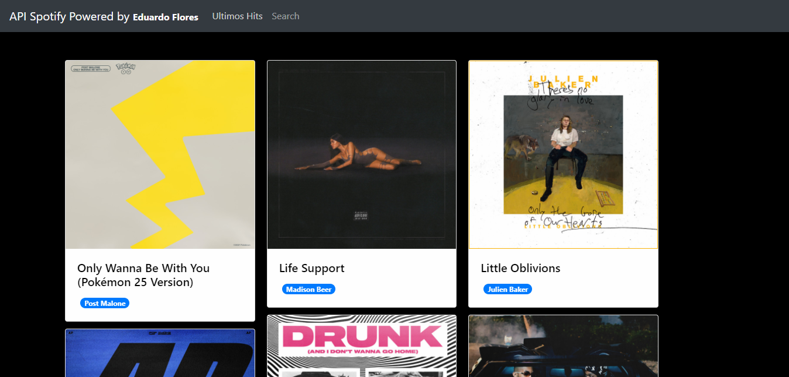
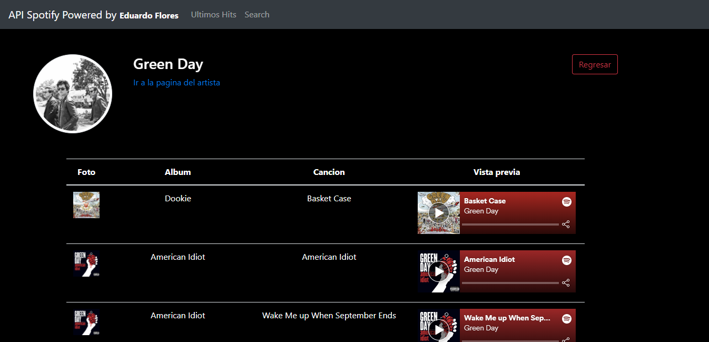
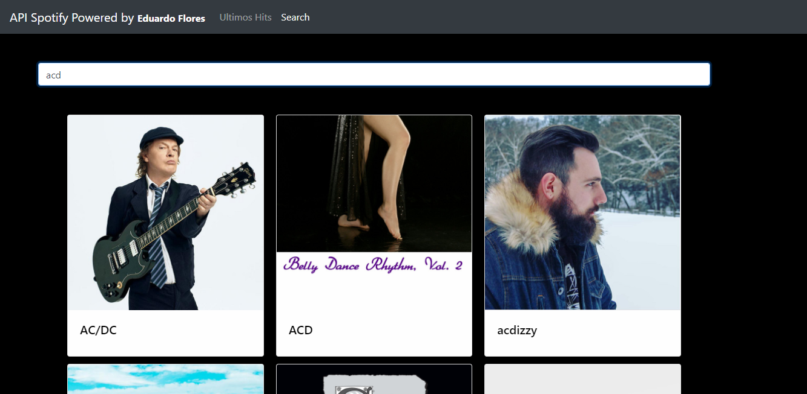
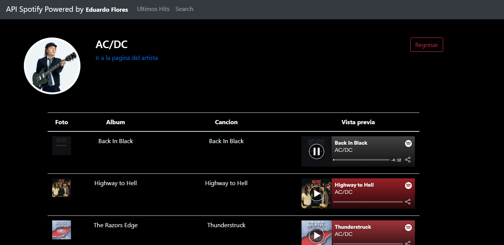

# API Spotify

Aplicación desarrollada en **Angular** en la que consume los servicios de Spotify mediante su API, para poder consumir esta API es necesario estar registrado en Spotify, ya que genera un token de acceso a la API con duración de 1 hora.

#### Capturas

